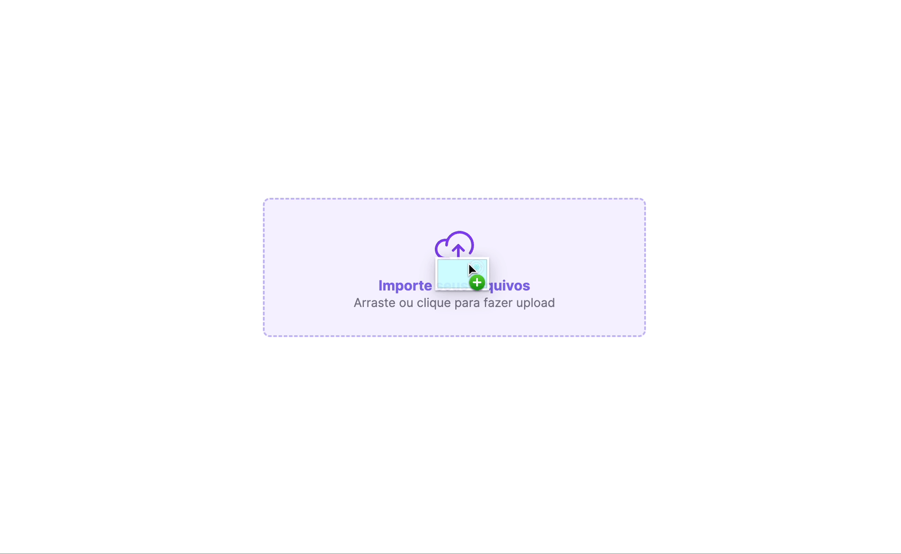
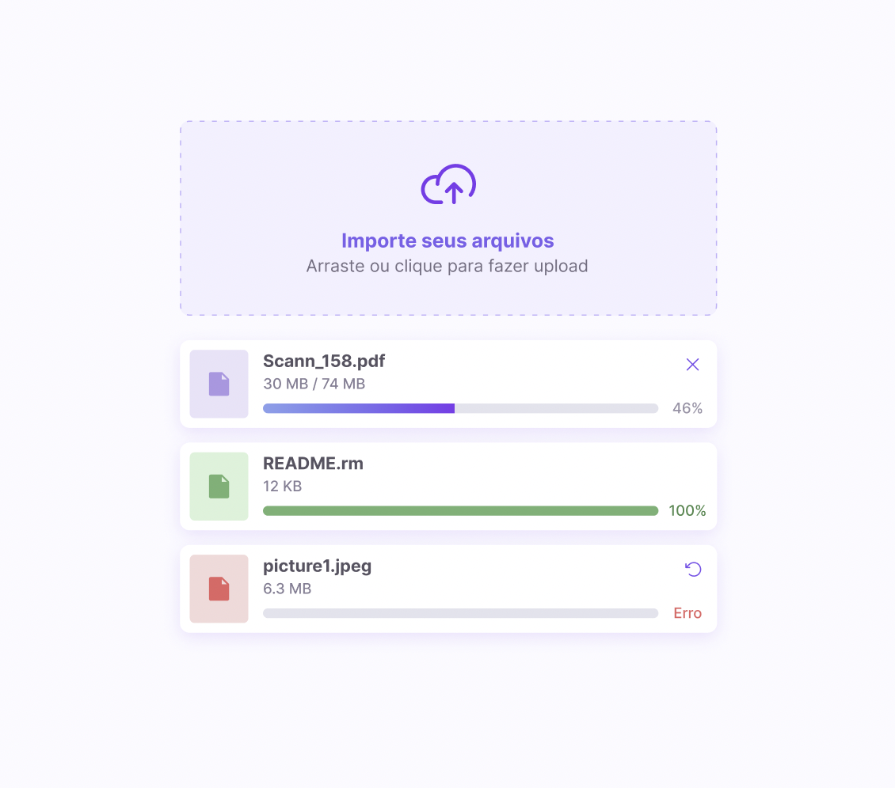

<h1 align="center"> #14 Um componente de upload </h1>

É o #14 desafio <a href="https://boracodar.dev/">#BORACODAR</a> da RocketSeat 

  <a href="#-tecnologias">Tecnologias</a>&nbsp;&nbsp;&nbsp;|&nbsp;&nbsp;&nbsp;
  <a href="#-projeto">Projeto</a>&nbsp;&nbsp;&nbsp;|&nbsp;&nbsp;&nbsp;
  <a href="#-layout">Layout</a>&nbsp;&nbsp;&nbsp;|&nbsp;&nbsp;&nbsp;
  <a href="#-collaborators">Collaborators</a>&nbsp;&nbsp;&nbsp;|&nbsp;&nbsp;&nbsp;

 

  

## 🚀 Tecnologias

Esse projeto foi desenvolvido com as seguintes tecnologias:

- HTML
- CSS
- JavaScript
- React
- Git e Github
- Figma
- Next

## 💻 Projeto

O projeto _Uploader_ foi realizado como parte do #14 desafio #BORACODAR da RocketSeat sugerido pelo professor <a href="https://github.com/maykbrito" alt="Link para o GitHub do professor Mayk Brito" target="_blank">Mayk Brito</a>.

<h1 align="center">
  Funcionalidades
</h1>

O desafio foi a criação de um componente de upload, o layout proposto está disponível em <a href="#-layout-figma">Layout</a>.

### Casos do uploader

É possível clicar para selecionar ou arrastar o arquivo. Caso o arquivo tenha sido selecionado corretamente, iniciará o carregamento e ele será concluído. Após a seleção de algum arquivo, ao tentar novamente, e clicar em cancelar cairá no caso de erro.

_<h2 align="center" ><a href="https://component-upload-boracodar-project-k6szg8hif-rickazuo.vercel.app/" target="_blank">Visite o projeto online</a></h2>_

## 🔖 Layout

Você pode visualizar o layout proposto pela RocketSeat através do da <a href="#-layout-figma">imagem abaixo</a>. Disponibilizado pelo [Figma](https://figma.com) durante o período do desafio.

  

## 📃 Collaborators

This challange was made by [Julia](https://gsajulia.github.io) and [Ricardo](https://rickazuo.github.io/portfolio/)
